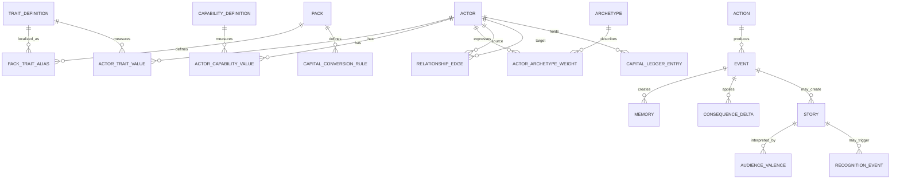

# Schema Overview

## Purpose

This document defines the v0 conceptual schema for **Power & Proximity**. It is a contract for later TypeScript types, JSON schemas, fixtures, validators, and deterministic simulation code.

The schema is intentionally implementation-neutral during the foundation sprint.

## System map

```mermaid
flowchart TD
    Game[Power & Proximity]

    Game --> Human[Universal Human Substrate]
    Game --> Packs[Domain Packs]
    Game --> Graph[Social Graph]
    Game --> Events[Event and Choice System]
    Game --> Stories[Reputation and Known Stories]
    Game --> Capital[Capital and Access]
    Game --> Institutions[Institutional Consequence]

    Human --> Identity[Identity and Context]
    Human --> Traits[Disposition Traits]
    Human --> Capabilities[Capabilities]
    Human --> Pressures[Current Pressures]
    Human --> Derived[Derived Attributes]
    Human --> SelfConcept[Self-Concept and Habits]

    Packs --> Aliases[Domain Aliases]
    Packs --> Roles[Roles and Organizations]
    Packs --> Scenarios[Scenarios and Actions]
    Packs --> Conversions[Context and Conversion Rules]

    Graph --> Actors[Actors]
    Graph --> Relationships[Relationship Edges]
    Graph --> Paths[Degree and Influence Paths]

    Events --> Memories[Memories]
    Events --> Deltas[Consequence Deltas]
    Events --> Ripples[Ripple Propagation]

    Stories --> Notoriety[Notoriety]
    Stories --> Audience[Audience Valence]
    Stories --> Recognition[Recognition Events]

    Capital --> Trust[Trust and Goodwill]
    Capital --> Influence[Influence and Leverage]
    Capital --> Access[Access and Favors]
    Capital --> Heat[Heat and Public Visibility]

    Institutions --> Merit[Merit Integrity]
    Institutions --> Legitimacy[Legitimacy and Truth Quality]
    Institutions --> Shortcut[Shortcut Gain]
    Institutions --> Debt[Institutional Debt]
    Institutions --> Theft[Opportunity Theft]
```



## Core entities

### Actor

A persistent person-like participant that can move between packs.

Required conceptual fields:

- stable identifier;
- display name;
- identity and context;
- disposition trait values;
- capability values;
- current pressures;
- derived attributes;
- self-concept weights;
- roles and organization memberships;
- memories;
- relationships;
- known stories;
- capital ledger;
- active pack context.

### Lightweight actor

A reduced participant such as a pet. Lightweight actors may have needs, temperament, bonds, and memories without carrying the full human identity or institutional schema.

### Identity context

Identity fields describe lived context, social categorization, belonging, visibility, and possible institutional treatment. They do not directly determine behavior or capability.

Examples:

- age and life stage;
- gender identity, expression, and pronouns;
- sexual and romantic orientation;
- race, ethnicity, culture, and language;
- religion or community affiliation;
- class background and current class position;
- disability, health, migration, family, and housing context;
- field-level visibility and privacy.

### Trait definition

A universal continuous disposition such as willfulness, cunning, pragmatism, compassion, integrity, discipline, resentment, forgiveness, or risk tolerance.

Traits should normally use a normalized range such as `0..100` and expose human-readable region labels without reducing the stored value to a class.

### Capability definition

A learned, cognitive, social, technical, or physical capacity.

Examples:

- analytical, social, emotional, and practical intelligence;
- verbal skill and systems thinking;
- domain expertise and literacy;
- strength, endurance, agility, and coordination.

Capabilities explain what an actor can do. Traits explain how they tend to choose or react.

### Derived attribute

A value calculated from base traits, capabilities, reputation, role legitimacy, and context.

Example:

```text
PersonalGravitas =
  composure
+ credibility
+ integrity
+ competence
+ confidence
+ verbalSkill
+ reputation
- erraticism
- vanityPenalty
```

```text
ContextualGravitas =
  PersonalGravitas
× RoleLegitimacy
× AudienceFit
× MomentRelevance
```

The implementation must normalize inputs before multiplication or weighted combination.

### Archetype

A prototype vector used to summarize a pattern without replacing continuous traits.

An actor may have several weighted archetype fits. Archetypes are descriptive and predictive, not immutable classes.

### Domain pack

A portable content package that supplies:

- roles and organizations;
- domain aliases for universal concepts;
- issue vectors;
- resources and pressures;
- scenarios, actions, and event templates;
- narrative templates;
- pack-specific capability requirements;
- capital conversion and recognition rules.

### Pack trait alias

A domain-facing label or interpretation for a universal concept.

Example:

| Universal concept | Politics | Restaurant | Gym | Research | Technology |
|---|---|---|---|---|---|
| Gravitas | Statesmanship | Floor authority | Coach presence | Scholarly authority | Architectural authority |

Aliases must not create divergent storage keys for the same underlying concept.

### Organization

A persistent institutional actor with resources, roles, policies, habits, legitimacy, truth quality, shortcut dependence, and debt.

### Relationship edge

A directed or bidirectional connection between nodes.

Candidate fields:

- source and target identifiers;
- relationship type;
- strength;
- trust;
- sentiment;
- dependency;
- information quality;
- visibility;
- risk;
- domain and issue tags;
- last meaningful interaction.

### Event

A structured occurrence that records context, participants, choice, direct effects, memories, story effects, and graph ripples.

### Memory

An actor-specific interpretation of an event.

Candidate fields:

- event identifier;
- subject and object actors;
- emotional tags;
- perceived harm or benefit;
- certainty;
- salience;
- decay or hardening rate;
- private/public visibility;
- effect on future decisions.

### Story

A socially transmissible interpretation of an event.

Candidate fields:

- subject actor;
- concise recognition summary;
- notoriety;
- story clarity;
- controversy;
- recency;
- source credibility;
- audience-specific valence;
- domain relevance;
- corrections, competing versions, or rumor status.

### Audience group

A social or institutional group that interprets stories and actions through shared interests or values, such as workers, owners, activists, journalists, landlords, or police.

### Recognition event

A cross-context interaction triggered when a new actor or group recognizes a known story.

```text
RecognitionChance =
  Notoriety
× DomainRelevance
× NetworkProximity
× StoryClarity
× Recency
```

The reaction is audience-specific. Recognition may create trust, access, heat, suspicion, or opportunity.

### Capital ledger

Tracks transferable and contextual social resources.

Candidate forms:

- influence;
- trust;
- goodwill;
- leverage;
- credibility;
- access;
- favors;
- heat;
- legitimacy;
- notoriety.

Capital is not a generic coin balance. Transfer depends on source recognition and pack context.

### Consequence delta

A typed change produced by an event, such as:

- trait drift;
- relationship change;
- memory creation;
- capital change;
- organizational habit change;
- story creation or spread;
- pressure change;
- access or opportunity change.

## Core relationships



## Behavioral decision contract

Traits alone do not determine behavior.

```text
BehaviorScore(action) =
  Σ(TraitValue × ActionTraitWeight)
+ Σ(CapabilityValue × ActionCapabilityWeight)
+ RolePressure
+ RelationshipPressure
+ MemoryModifier
+ CurrentStress
- RiskPenalty
```

The engine should choose or rank actions deterministically for a fixed state and seed. Constraints may make the highest-preference action unavailable.

## Graph influence contract

```text
EdgeTransmission =
  RelationshipStrength
× Trust
× InformationQuality
× Visibility
× ContextFit
```

```text
PathInfluence =
  product(EdgeTransmission)
× exp(-lambda × (degree - 1))
```

```text
TotalInfluence =
  sum(PathInfluence across valid paths)
```

Multiplication makes a weak edge degrade the path. Summation allows several independent paths to create coalition pressure.

## Character formation contract

```text
Situation
-> Choice
-> Outcome
-> Memory
-> Disposition Drift
-> Habit
-> Self-Concept
-> Reputation
-> Future Bias
```

Identity is not rewritten by behavioral scoring. Identity expression or disclosure may change through explicit story events, but behavior primarily shifts disposition, habits, self-concept, relationships, and reputation.

## Institutional consequence contract

```text
InstitutionalOutcome =
  LegitimateCapacity
+ ShortcutGain
- InstitutionalDebt
- OpportunityTheft
- TruthDecay
```

```text
LegitimateCapacity =
  Merit
+ Trust
+ Competence
+ Transparency
+ Fairness
+ Cooperation
```

Shortcut gain must be immediately useful. Institutional debt must create delayed operating friction, legal exposure, resentment, talent loss, bad data, or correction cost.

## Cross-pack continuity contract

When an actor changes domains, the following persist:

- identity and context;
- base traits and capabilities;
- memories and self-concept;
- relationship graph edges;
- known stories;
- capital, subject to conversion rules.

The new pack provides aliases, pressures, opportunities, audiences, and issue relevance.

> Traits persist. Stories transfer. Capital converts. Packs reinterpret.

## v0 schema boundaries

The first schema sprint should define and validate:

- actor;
- identity context and visibility;
- trait and capability definitions;
- derived attributes;
- pack and alias definitions;
- organization;
- relationship edge;
- event, action, memory, and consequence delta;
- story, audience valence, and recognition event;
- capital definition and ledger entry.

The v0 schema should not yet encode:

- a production database;
- city-scale generation;
- monetization;
- full auto-mode;
- UI layout;
- one-off pack-specific primitive traits without a universality review.
